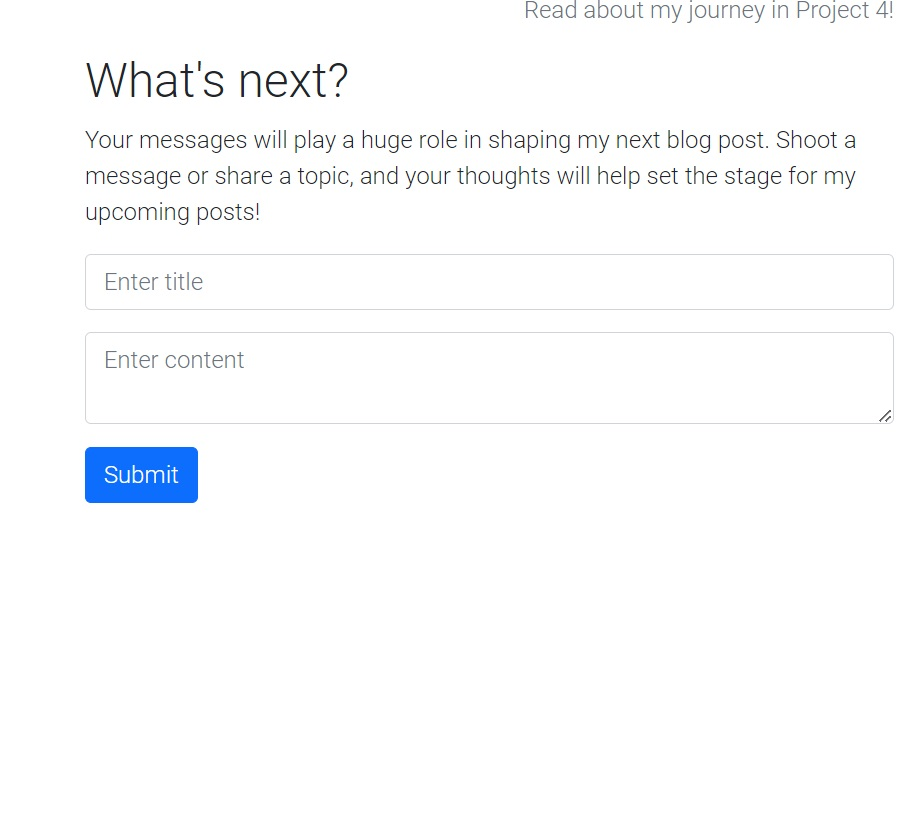

# Project-4
<h1 align="center">Project4</h1>

[View the live project here.](https://md-project-4-db497f716926.herokuapp.com/)

This Python-based project is designed to offer simplicity and informative content, ensuring ease of navigation across various devices. The project aims to deliver a user-friendly interface, providing comprehensive information while ensuring compatibility and responsiveness across different device screens.

## User Experience (UX)

- ### User stories
  - #### First Time Visitor Goals
    1. First time visitors should be able to see that the purpose of this page is view blog posts by me.
    2. They should also be able to easily navigate through the different pages internally and externally.
  - #### Returning Visitor Goals
    1. Returning visitors should be able to easily access different stages of the blog event.
    2. Returning visitors should be able to give feedback on the information provided and also be able to ask questions.
    3. They should also be able to visit appropriate external sites within the community.
  - #### Frequent User Goals
    1. Frequent users should be able to signup up to further their communications.
    2. The site incorporates features allowing users to create accounts to engage in commenting and posting, fostering a sense of community interaction and contribution.

- ### Design
  - #### Colour Scheme
    - The site is styled to resemble a blog post, with a color scheme reminiscent of Reddit, predominantly featuring shades of grey, black, and red (#FF4500) to evoke a sense of familiarity and readability akin to the Reddit platform.

  - #### Typography
    - Utilizing the Roboto font as the primary typeface gives the website a professional feel, aligning with the context of the blog and enhancing the overall thematic presentation.
  - #### Imagery
    - Images used are posted by myself, the admin.

## Features
- Responsive on all device sizes
- Interactive elements

## Technologies Used

### Languages Used
- [HTML5](https://en.wikipedia.org/wiki/HTML5)
- [CSS3](https://en.wikipedia.org/wiki/Cascading_Style_Sheets)
- [JS] (https://en.wikipedia.org/wiki/JavaScript)
- [Python] (https://en.wikipedia.org/wiki/Python_(programming_language))

### Frameworks, Libraries & Programs Used
1. [Font Awesome](https://fontawesome.com/): Font Awesome was used on all pages throughout the website to add icons for aesthetic and UX purposes.
2. [Git](https://git-scm.com/): Git was used for version control by utilizing the Gitpod terminal to commit to Git and push to GitHub.
3. [GitHub](https://github.com/): GitHub is used to store the project's code after being pushed from Git.
4. [Django] (https://en.wikipedia.org/wiki/Django_(web_framework))
5. [Cloudinary] (https://cloudinary.com/)

## Testing

The W3C Markup Validator and W3C CSS Validator Services were used to validate every page of the project to ensure there were no syntax errors in the project.

- [W3C Markup Validator](https://jigsaw.w3.org/css-validator/#validate_by_input) 
- [W3C CSS Validator](https://jigsaw.w3.org/css-validator/#validate_by_input) 
- [W3C JS Validator] (https://www.w3schools.com/js/js_validation.asp)
- [Python Validator] (https://www.w3schools.com/python/python_ml_cross_validation.asp)

### Testing User Stories from User Experience (UX) Section

- #### First Time Visitor Goals
  1. First time visitors should be able to see that the purpose of this page is to blog.
     - The first page that visitors are greeted with is the index page..
       
     - The user then has the option to register via the nav bar.
       
     - Users who register will have to wait for the admin to approve.
       
     - They can then sign in.
       
  2. They should also be able to easily navigate through the different pages internally and externally.
     - The site has been designed so that every internal page is easily accessible from the nav bar.
       
     - The site also has the external links in the footer to be easily accessible.
       

- #### Returning Visitor Goals
  1. Returning visitors should be able to easily access different parts of the blog.
     - Once they click the main post on the index page they will be shown a view ways to interact. One being that you can like/unlike the post. Another being that they can write comments.
     
     - The comments will only show once the admin has approved.
     
  2. Returning visitors should be able to ask questions.
     - On the right of the index page you will find a section which lets users post to the index page.
     
     -They will then have the post appear under the adminds blog post.
      
  
- #### Frequent User Goals
  1. Frequent users should be able to register and communicate with admin freely.
     - The user would already be comfortable with the website layout and will know how to navigate to the sign-up page.

### Further Testing
- The website was tested on Google Chrome, Apple's browser, Internet Explorer, and Firefox.
- The website was viewed on multiple devices, ranging from the latest Samsungs, iPhone 13s, and iPads.
- Pages were tested regularly to ensure all links and media work.
- Friends and family members were asked to review the site to help with design and errors to see if anything was missed.

## Deployment

### GitHub Pages
The project was deployed to Heroku.

## Credits

### Code
- The majority of the code was written by the developer, with assistance from previous Python & Django modules.

### Media
- All media is uploaded by Admin via blog posts.

### Acknowledgements
- My mentor, Dario, helped me a lot along the way.
- A developer friend, Ainsley Chang, also provided valuable assistance.
- Tutor support at Code Institute for their immense support.
